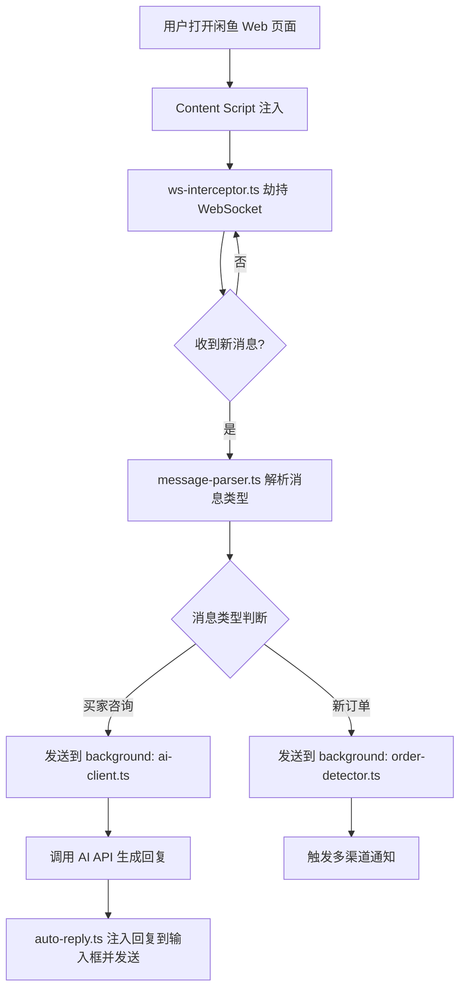
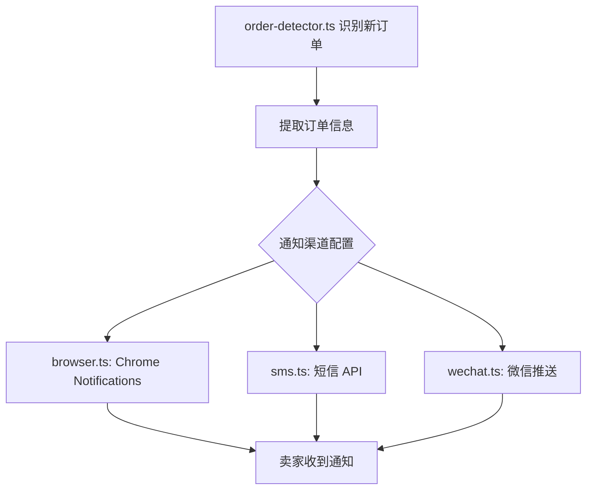

# 闲鱼智能客服 Chrome 扩展 — 架构规划

## 一、项目目标

构建一个纯 Chrome 扩展（Manifest V3），在闲鱼 Web 端实现：

1. **智能客服**：基于 AI 大模型自动回复买家咨询（参考 XianyuAutoAgent 技术思路）
2. **订单通知**：检测到新订单时，通过浏览器推送 + 短信 + 微信多渠道通知卖家发货
3. **可配置**：AI 模型、通知渠道、商品话术均可在扩展设置页配置

---

## 二、技术选型

| 模块 | 技术方案 |
|------|---------|
| 扩展框架 | Chrome Extension Manifest V3 |
| 前端构建 | Vite + TypeScript + React（Options/Popup 页面） |
| 消息拦截 | Content Script 注入 + WebSocket 劫持 |
| AI 接入 | 直接调用第三方 API（OpenAI / DeepSeek / 通义千问，可配置） |
| 浏览器通知 | Chrome Notifications API |
| 短信通知 | 阿里云短信 / 腾讯云短信 API（从扩展 background 直接调用） |
| 微信通知 | Server酱 / WxPusher / 企业微信 Webhook（可配置） |
| 数据存储 | chrome.storage.sync（配置）+ chrome.storage.local（会话历史） |

---

## 三、扩展目录结构

```
xianyu-extension/
├── manifest.json              # MV3 清单
├── src/
│   ├── background/
│   │   ├── index.ts           # Service Worker 入口
│   │   ├── ai-client.ts       # AI API 调用封装
│   │   ├── notify/
│   │   │   ├── browser.ts     # 浏览器推送通知
│   │   │   ├── sms.ts         # 短信通知
│   │   │   └── wechat.ts      # 微信通知（Server酱/WxPusher）
│   │   └── order-detector.ts  # 订单状态识别逻辑
│   ├── content/
│   │   ├── index.ts           # 注入闲鱼页面的主脚本
│   │   ├── ws-interceptor.ts  # WebSocket 消息拦截
│   │   ├── message-parser.ts  # 消息协议解析（参考 XianyuAutoAgent）
│   │   └── auto-reply.ts      # 自动回复注入
│   ├── options/
│   │   ├── index.html
│   │   ├── App.tsx            # 设置页面（React）
│   │   └── components/
│   │       ├── AIConfig.tsx   # AI 模型配置
│   │       ├── NotifyConfig.tsx # 通知渠道配置
│   │       └── PromptConfig.tsx # 话术/System Prompt 配置
│   ├── popup/
│   │   ├── index.html
│   │   └── App.tsx            # 快捷状态面板
│   └── shared/
│       ├── types.ts           # 共享类型定义
│       ├── storage.ts         # chrome.storage 封装
│       └── constants.ts
├── public/
│   └── icons/
├── vite.config.ts
└── package.json
```

---

## 四、核心流程设计

### 4.1 消息采集与 AI 自动回复流程



### 4.2 订单通知流程



### 4.3 WebSocket 劫持原理（参考 XianyuAutoAgent）

闲鱼 Web 端使用 WebSocket 长连接进行实时消息通信。Content Script 通过以下方式拦截：

```typescript
// ws-interceptor.ts 核心思路
const OriginalWebSocket = window.WebSocket;
window.WebSocket = new Proxy(OriginalWebSocket, {
  construct(target, args) {
    const ws = new target(...args);
    ws.addEventListener('message', (event) => {
      // 解析消息，转发给 background
    });
    return ws;
  }
});
```

---

## 五、AI 客服设计

### System Prompt 结构（参考 XianyuAutoAgent）

```
你是闲鱼平台的智能客服助手，负责帮助卖家回复买家咨询。
商品信息：{商品标题、描述、价格}
回复规则：
- 礼貌、简洁
- 价格不低于 {最低价}
- 遇到无法回答的问题，回复"稍等，我去问一下"
```

### AI 模型配置项

| 配置项 | 说明 |
|--------|------|
| `aiProvider` | openai / deepseek / qwen / custom |
| `apiKey` | 对应平台的 API Key |
| `baseUrl` | 自定义 API 地址（兼容 OpenAI 格式） |
| `model` | 模型名称，如 gpt-4o / deepseek-chat |
| `systemPrompt` | 自定义 System Prompt |
| `autoReplyEnabled` | 是否开启自动回复 |

---

## 六、通知渠道配置项

### 浏览器通知
- 无需额外配置，使用 `chrome.notifications` API

### 短信通知（阿里云/腾讯云）
| 配置项 | 说明 |
|--------|------|
| `smsProvider` | aliyun / tencent |
| `smsAccessKey` | AccessKey ID |
| `smsSecretKey` | AccessKey Secret |
| `smsSignName` | 短信签名 |
| `smsTemplateCode` | 短信模板 Code |
| `smsPhone` | 接收手机号 |

### 微信通知
| 配置项 | 说明 |
|--------|------|
| `wechatProvider` | serverchan / wxpusher / wecom |
| `wechatKey` | 对应平台的 Key/Token |

---

## 七、一期开发任务清单

### 阶段一：项目脚手架
- [ ] 初始化 Vite + TypeScript + React 项目
- [ ] 配置 `manifest.json`（MV3，声明权限：storage、notifications、host_permissions 闲鱼域名）
- [ ] 配置多入口构建（background、content、options、popup）

### 阶段二：消息采集核心
- [ ] 实现 `ws-interceptor.ts`：WebSocket 劫持，拦截闲鱼实时消息
- [ ] 实现 `message-parser.ts`：解析闲鱼消息协议，识别消息类型（咨询/订单/系统消息）
- [ ] 实现 Content Script 与 Background 的消息通信（`chrome.runtime.sendMessage`）

### 阶段三：AI 自动回复
- [ ] 实现 `ai-client.ts`：封装 OpenAI 兼容格式 API 调用（支持多 Provider）
- [ ] 实现 `auto-reply.ts`：将 AI 回复注入闲鱼输入框并触发发送
- [ ] 实现对话上下文管理（存储最近 N 条对话历史）

### 阶段四：订单通知
- [ ] 实现 `order-detector.ts`：从消息流中识别新订单事件
- [ ] 实现 `browser.ts`：Chrome 桌面通知
- [ ] 实现 `sms.ts`：阿里云/腾讯云短信 API 调用
- [ ] 实现 `wechat.ts`：Server酱 / WxPusher 推送

### 阶段五：配置页面
- [ ] 实现 Options 页面（React）：AI 配置、通知配置、话术配置
- [ ] 实现 Popup 页面：显示运行状态、快速开关自动回复
- [ ] 实现 `storage.ts`：chrome.storage 读写封装

### 阶段六：测试与打包
- [ ] 在闲鱼 Web 端测试 WebSocket 拦截是否正常
- [ ] 测试 AI 自动回复端到端流程
- [ ] 测试各通知渠道
- [ ] 打包为 `.crx` 或 unpacked 扩展供加载

---

## 八、关键风险与注意事项

| 风险 | 说明 | 应对 |
|------|------|------|
| 闲鱼消息协议变更 | 闲鱼可能更新 WebSocket 协议格式 | 参考 XianyuAutoAgent 的协议分析，做好版本兼容 |
| API Key 安全 | 扩展中存储的 API Key 可被用户自己查看 | 使用 chrome.storage.sync 加密存储，提示用户风险 |
| 短信/微信 API 跨域 | 从扩展 background 直接调用第三方 API 可能有 CORS 限制 | 在 manifest.json 中声明对应 host_permissions |
| 自动回复误触发 | AI 可能回复不当内容 | 提供"审核模式"：先展示回复，用户确认后再发送 |
| 闲鱼反爬 | 频繁自动操作可能触发风控 | 加入随机延迟，模拟人工操作节奏 |

---

## 九、参考资料

- [XianyuAutoAgent](https://github.com/shaxiu/XianyuAutoAgent) — 闲鱼 WebSocket 协议分析与 AI 客服实现参考
- [Chrome Extension MV3 文档](https://developer.chrome.com/docs/extensions/mv3/)
- [Server酱](https://sct.ftqq.com/) — 微信推送服务
- [WxPusher](https://wxpusher.zjiecode.com/) — 微信推送服务
